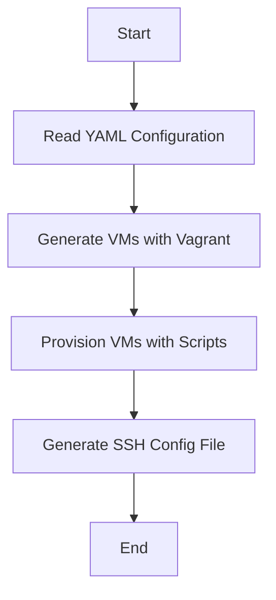
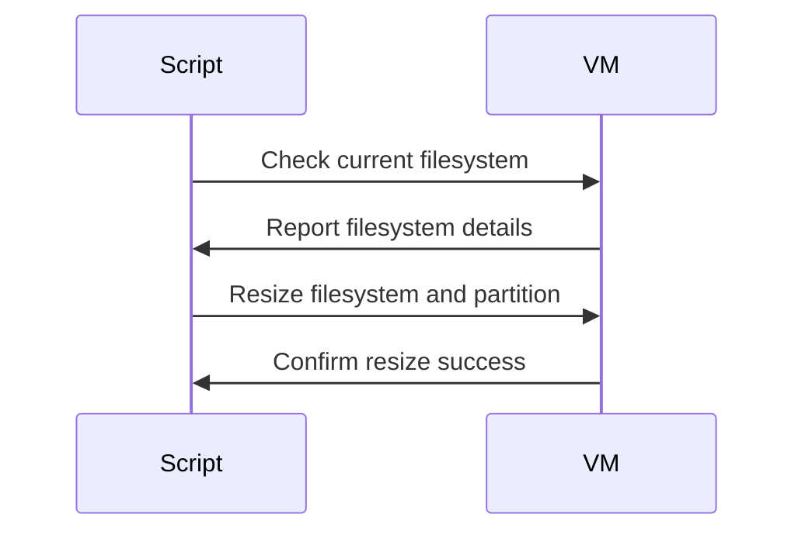
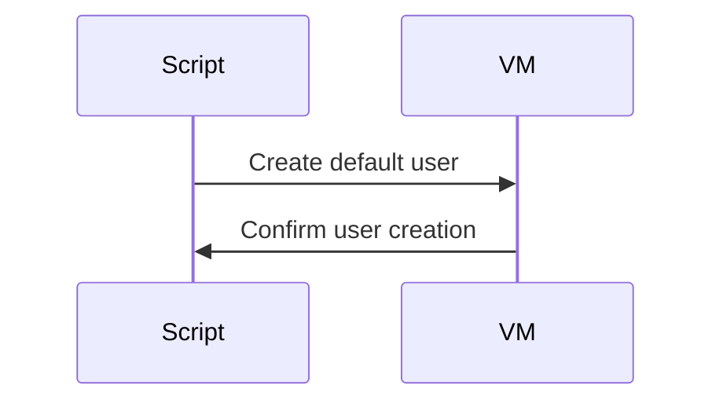
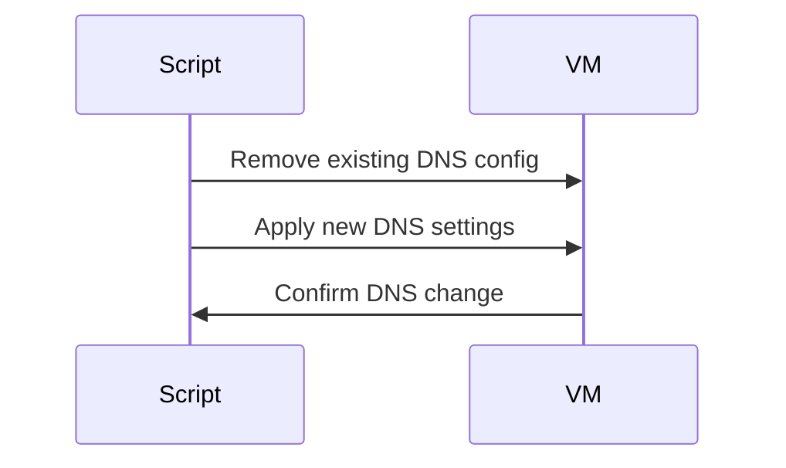
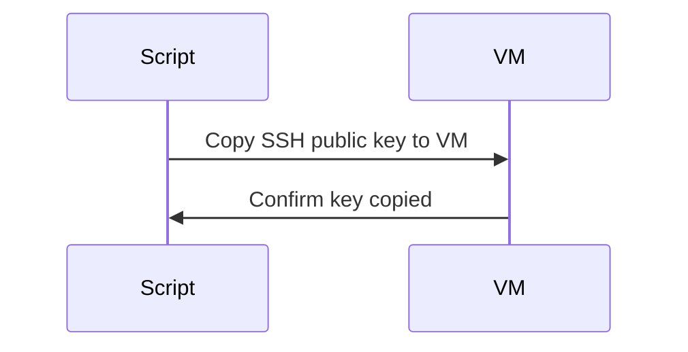

# Project Documentation

This documentation outlines the setup and functionality of a Vagrant-based environment designed for rapid deployment of virtual machines (VMs), including Kubernetes clusters. This solution is tested and used on Windows 11 with WSL and QEMU, aiming to serve as a basic blueprint for VM deployment and management. It leverages Ruby ERB templates and various scripts for flexible and centralized configuration. The project simplifies the setup process, requiring only QEMU installed to get started.

## Overview

The project allows for extensive customization through a YAML configuration file, supporting various scripts and ERB templates for dynamic configuration generation. At its core, it simplifies creating and managing VMs for development, testing, or prototyping purposes, with a special emphasis on ease of use and flexibility.

## Configuration

Configuration is handled via a `configuration.yaml` file, which centralizes settings such as the host operating system, default user credentials, SSH key management, and server specifications for control planes and worker nodes.

### YAML Configuration Highlights

- `vagrant_api_version`: Specifies the Vagrant API version.
- `host_os`: Defines the operating system for the VMs.
- `default_user`: Sets a default user for the VMs.
- `servers`: Lists server configurations, including control planes and worker nodes, with attributes like memory, CPU, and IP address.

## Key Features

- **SSH Config File Generation**: Automatically generates an SSH config file, enabling SSH connections to VMs using their names.
- **Script Execution**: Utilizes shell scripts for tasks like filesystem resizing, user addition, and DNS adjustments.
- **Flexible and Modular Setup**: Supports easy addition of VMs and customization of their configurations.

## Workflow Diagram

### General Solution Flow

### Script Execution Flow

#### Resize Filesystem (`resize_fs.sh`)

#### Add Default User (`add_user.sh`)

#### Change DNS Settings (`change_dns.sh`)

#### Copy SSH Public Key (`copy_ssh_pub.sh`)

## Getting Started

1. **Prerequisites**: Ensure QEMU is installed on your Windows 11 system.
2. **Configuration**: Adjust the `configuration.yaml` file according to your project needs.
3. **Execution**: Run `vagrant up` to start and provision your VMs according to the defined configuration.
4. **SSH Access**: Use the generated SSH config file with `ssh -F ssh_config <vm_name>` to connect to your VMs.

## Conclusion

This project offers a streamlined approach to VM deployment, emphasizing flexibility, ease of use, and the power of automation. It's particularly suited for quickly setting up environments for development, testing, or demonstrations, including Kubernetes clusters.

For further customization and expansion, the YAML configuration and ERB templates provide a solid foundation for adapting the setup to fit a wide range of use cases.

---