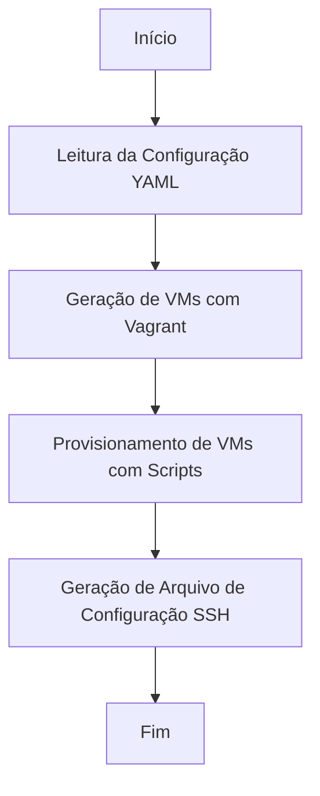
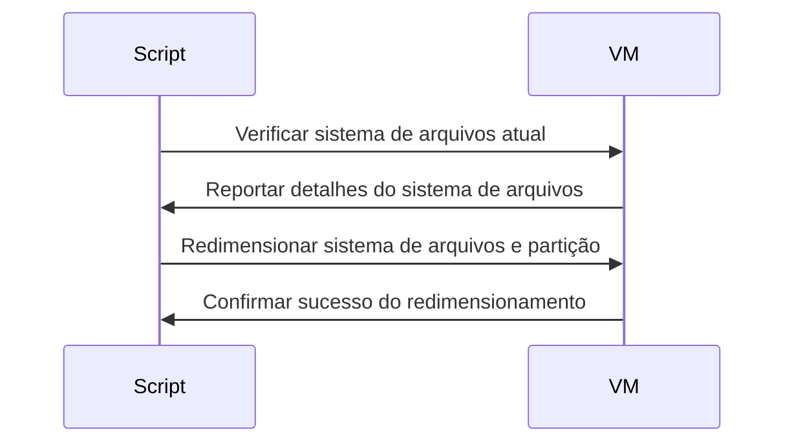
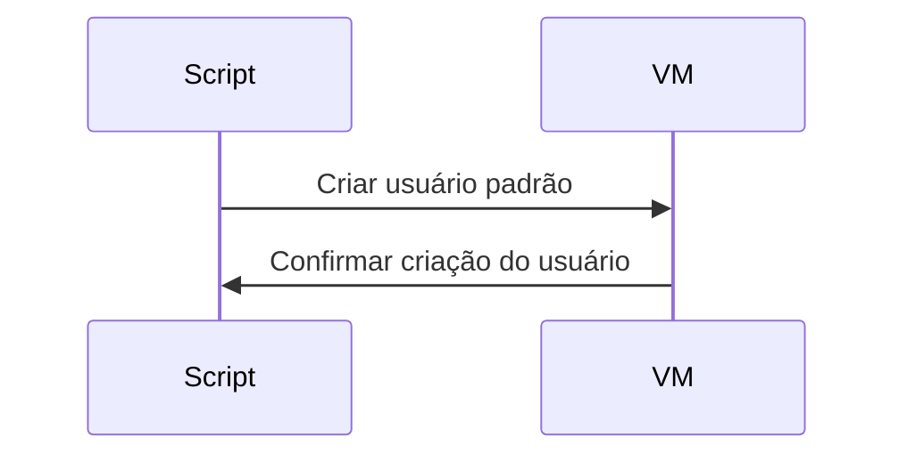
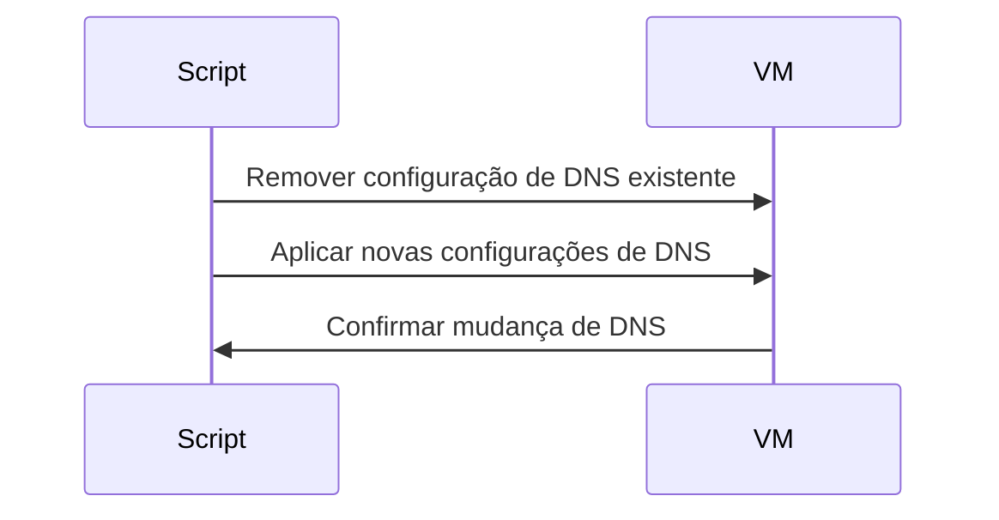
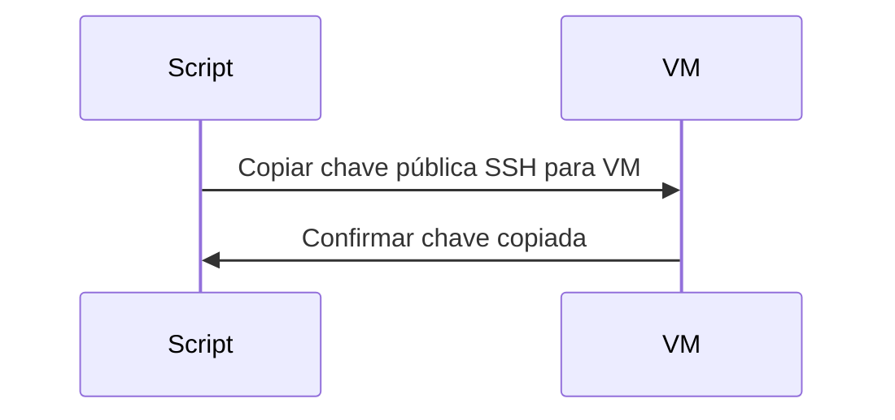

# Documentação do Projeto

Esta documentação descreve a configuração e funcionalidade de um ambiente baseado em Vagrant projetado para o rápido provisionamento de máquinas virtuais (VMs), incluindo clusters Kubernetes. Esta solução é testada e utilizada no Windows 11 com WSL e QEMU, visando servir como um modelo básico para o deployment e gerenciamento de VMs. Ela aproveita templates ERB do Ruby e diversos scripts para uma configuração flexível e centralizada. O projeto simplifica o processo de configuração, exigindo apenas a instalação do QEMU para começar.

## Visão Geral

O projeto permite uma ampla customização por meio de um arquivo de configuração YAML, suportando vários scripts e templates ERB para a geração dinâmica de configurações. Em sua essência, simplifica a criação e gerenciamento de VMs para desenvolvimento, teste ou propósitos de prototipagem, com ênfase especial na facilidade de uso e flexibilidade.

## Configuração

A configuração é gerenciada através de um arquivo `configuration.yaml`, centralizando configurações como o sistema operacional do host, credenciais do usuário padrão, gerenciamento de chave SSH e especificações do servidor para control planes e nós worker.

### Destaques da Configuração YAML

- `vagrant_api_version`: Especifica a versão da API do Vagrant.
- `host_os`: Define o sistema operacional para as VMs.
- `default_user`: Estabelece um usuário padrão para as VMs.
- `servers`: Lista as configurações do servidor, incluindo control planes e nós worker, com atributos como memória, CPU e endereço IP.

## Principais Recursos

- **Geração de Arquivo de Configuração SSH**: Gera automaticamente um arquivo de configuração SSH, permitindo conexões SSH às VMs usando seus nomes.
- **Execução de Script**: Utiliza scripts shell para tarefas como redimensionamento do sistema de arquivos, adição de usuário e ajustes de DNS.
- **Configuração Flexível e Modular**: Suporta a adição fácil de VMs e customização de suas configurações.

## Diagramas de Fluxo

### Fluxo Geral da Solução

### Fluxo de Execução dos Scripts

#### Redimensionar Sistema de Arquivos (`resize_fs.sh`)

#### Adicionar Usuário Padrão (`add_user.sh`)

#### Alterar Configurações de DNS (`change_dns.sh`)

#### Copiar Chave Pública SSH (`copy_ssh_pub.sh`)

## Primeiros Passos

1. **Pré-requisitos**: Certifique-se de que o QEMU está instalado no seu sistema Windows 11.
2. **Configuração**: Ajuste o arquivo `configuration.yaml` de acordo com as necessidades do seu projeto.
3. **Execução**: Execute `vagrant up` para iniciar e provisionar suas VMs